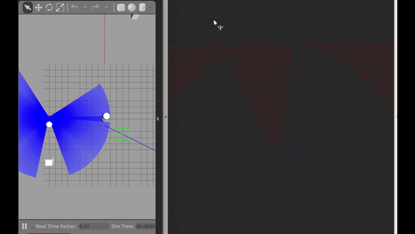

# Racecar-Local-Planner-
ROS package for a motion planner used in head-to-head autonomous racing.

The ROS package works coupled with the F110 repository for simulations. 
Add the repository and follow the instructions for installing as given in the readme of the repository. 

git clone https://github.com/mlab-upenn/f110-fall2018-skeletons.git

Clone the repository in the source folder of your ROS Workspace. 

clone the MPC_RRT_Planner in the same Source folder. 

These dependencies are important to install the package: 

1. CSV
2. numpy
3. Scipy
4. IPOPT (Ubuntu 16.04 and above) 
	$ sudo apt install build-essential python-dev python-six cython coinor-libipopt1v5 coinor-libipopt-dev
	$ git clone https://github.com/matthias-k/cyipopt.git
	$ cd cyipopt
	$ sudo python setup.py install
5. clone the repository 
6. Locate the scripts Locate the scripts ‘MPC_tracker.py’ and ‘next_waypoint.py’ and make them executable using the
following command.
	$ chmod +x “script name”

7. source the current setup file from the ROS workspace and make the workspace using command catkin_make
8. Roslaunch the package: 
	$ roslaunch Racecar-Local-Planner RRT_MPC_SIM.launch

For any issues mail on sidsingh@seas.upenn.edu or Singh.sid930@gmail.com

